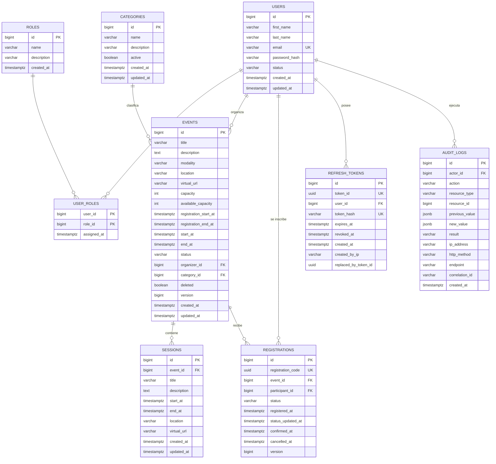

# Academic Events API


Proyecto integrador de la materia: una API REST para gestionar eventos académicos (usuarios, eventos, sesiones e inscripciones), con autenticación JWT, autorización por roles, límites de uso con Redis y generación de reportes en PDF y Excel.

Es un trabajo individual, aunque el enunciado original estaba planteado para parejas; esto fue confirmado con el docente.

## En qué va el proyecto

Todos los módulos de dominio están terminados y probados contra una base de datos real:

- Proyecto generado con Spring Initializr (Java 25, Spring Boot 4.1.0, Gradle con Kotlin DSL).
- Base de datos por scripts SQL del docente (no Hibernate), migradas con Flyway. `ddl-auto=validate`.
- Autenticación JWT (access + refresh con rotación y revocación), autorización por rol y por propiedad del recurso, manejo centralizado de excepciones con formato uniforme.
- Módulos: usuarios/roles, categorías, eventos y sesiones (con reglas de negocio: propiedad del organizador, estados, cupos, eliminación lógica), inscripciones (manejo transaccional de cupo), reportes (PDF/Excel/certificados + indicadores).
- Redis para límites de solicitudes (por IP y por usuario) y bloqueo temporal tras intentos fallidos de login, con contadores atómicos (script Lua) en vez de Bucket4j — ver detalle más abajo.
- Un detalle a tener en cuenta: OpenPDF a partir de la versión 3 cambió su paquete raíz de `com.lowagie` a `org.openpdf`; el módulo de reportes usa los imports nuevos.

## Corrección en el script de datos iniciales

Revisando el script `V1__initial_schema_and_data.sql` antes de ejecutarlo, apareció un carácter suelto que rompía la migración. En la línea 742, entre el bloque de inscripciones (`registrations`) y el de auditoría (`audit_logs`), había una línea con solo una `s`, algo que no es ni una sentencia SQL válida ni un comentario.

Eso hace que la ejecución del script se corte justo ahí, así que los cinco registros de `audit_logs` nunca llegarían a insertarse. Se quitó esa línea y el resto del archivo queda igual.

Antes:

```sql
    (45, '00000000-0000-4000-8000-000000000045', 10, 15, 'CONFIRMED', ...);

s
-- --------------------------------------------------------------------------
-- Auditoría de ejemplo
```

Después:

```sql
    (45, '00000000-0000-4000-8000-000000000045', 10, 15, 'CONFIRMED', ...);

-- --------------------------------------------------------------------------
-- Auditoría de ejemplo
```

## Modelo de datos

El esquema entregado incluye: `roles`, `users`, `user_roles`, `categories`, `events`, `sessions`, `registrations`, `refresh_tokens` y `audit_logs`. Entre las cosas que ya vienen resueltas en el script están las restricciones de negocio a nivel de base de datos (por ejemplo, que un evento presencial tenga ubicación y no enlace virtual, o que una inscripción confirmada tenga fecha de confirmación), los triggers para mantener `updated_at`, y el manejo de concurrencia optimista con una columna `version` en `events` y `registrations`.

## Diagrama entidad-relación



Generado a partir del esquema real (`sql/V1__initial_schema_and_data.sql`), no al revés. `user_roles` es una tabla intermedia con clave compuesta (`user_id`, `role_id`). `refresh_tokens` y `audit_logs` no tienen entidad "hija" propia; ambas cuelgan directamente de `users`.

## Cómo levantar la base de datos

`00_create_database.sql` crea la base vacía y se ejecuta a mano una sola vez (Flyway no puede crear una base de datos, solo migrar dentro de una que ya existe). El resto del esquema y los datos iniciales los aplica Flyway solo al arrancar la aplicación, desde `src/main/resources/db/migration/V1__initial_schema_and_data.sql`.

```bash
docker exec -i <contenedor-postgres> psql -U <usuario> -d postgres < sql/00_create_database.sql
```

Luego, al levantar la app (`./gradlew bootRun`) con Postgres y Redis corriendo, Flyway migra el esquema automáticamente.

## Lo que falta

- Diagrama entidad-relación: ✅ hecho (arriba).
- Documentación OpenAPI/Swagger: falta configurar el esquema Bearer JWT en la UI y proteger `/swagger-ui/**` y `/v3/api-docs/**` en producción.
- Pruebas automatizadas (JUnit/Mockito).
- Colección Postman/Bruno.
- Dockerfile, `render.yaml` y despliegue en Render.
