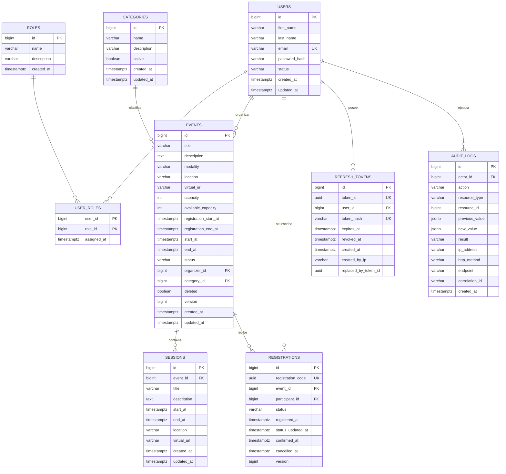

# Academic Events API

API REST para la gestión de eventos académicos: usuarios, categorías, eventos y sesiones, inscripciones, y reportes descargables. Incluye autenticación JWT con rotación de refresh tokens, autorización por rol y por propiedad del recurso, límites de solicitudes y bloqueo temporal con Redis, manejo centralizado de excepciones, documentación OpenAPI/Swagger, observabilidad con Actuator, y despliegue en contenedor Docker.

Stack: Java 25, Spring Boot 4.1.0, Spring Data JPA, Spring Security, PostgreSQL, Flyway, Spring Data Redis, Springdoc OpenAPI, Spring Boot Actuator, Apache POI, OpenPDF, JUnit 5, Mockito, Docker.

Proyecto integrador desarrollado de forma individual (el enunciado original estaba planteado para parejas; confirmado con el docente que se trabaja solo).

## Despliegue

- **API pública**: https://academic-events-api-2tkw.onrender.com
- **Swagger UI**: https://academic-events-api-2tkw.onrender.com/swagger-ui/index.html — protegido con usuario y contraseña de evaluación (variables `SWAGGER_USERNAME`/`SWAGGER_PASSWORD` en Render), independiente del login JWT de la API.
- **Health check**: https://academic-events-api-2tkw.onrender.com/actuator/health

Desplegado en Render mediante Blueprint (`render.yaml`): base de datos PostgreSQL, almacén Key Value (Redis) y servicio web Docker, cada uno como servicio separado.

Usuarios de prueba (datos iniciales del script SQL, contraseña común `Password123*`):

| Correo | Rol |
|---|---|
| `admin@academic.test` | ADMIN |
| `maria.cordero@academic.test` | ORGANIZER + PARTICIPANT |

## Módulos

- **auth**: registro, login, refresh (con rotación y revocación), logout, usuario autenticado (`/me`). Contraseñas con BCrypt, mensajes de error genéricos para no revelar si un correo existe.
- **category**: CRUD de categorías, solo ADMIN puede crear/editar/eliminar; lectura pública con paginación, filtro por estado y búsqueda por nombre.
- **event / session**: CRUD de eventos con validación de fechas y de datos según modalidad (presencial/virtual/híbrida), transición de estados (`DRAFT` → `PUBLISHED` → `FINISHED`/`CANCELLED`), propiedad del organizador, filtros dinámicos con `Specification`. Sesiones anidadas bajo cada evento.
- **registration**: inscripción y cancelación de participantes, con manejo transaccional del cupo disponible del evento; confirmación/rechazo por parte del organizador; no permite inscripciones duplicadas, en eventos sin cupo o fuera del período de inscripción.
- **report**: descarga de listado de inscritos en PDF (OpenPDF) y Excel (Apache POI) con filtro por rango de fechas, certificado de inscripción confirmada, e indicadores del sistema (ADMIN) y por evento (propietario/ADMIN).
- **ratelimit**: contadores atómicos sobre Redis (script Lua `INCR`+`EXPIRE`) para los 5 límites de solicitudes de la tabla de abajo, y bloqueo temporal de 15 minutos tras 5 intentos fallidos de login. Se implementó a mano en vez de con Bucket4j: la librería requiere un segundo cliente Redis separado del que administra Spring Boot, con partes de su API ya deprecadas en la versión usada; el enunciado permite explícitamente "Bucket4j o equivalente".

| Operación | Identificador | Límite |
|---|---|---|
| Login | IP + correo | 5 solicitudes/minuto |
| Registro | IP | 3 solicitudes/hora |
| Endpoints públicos | IP | 60 solicitudes/minuto |
| Endpoints autenticados | Usuario autenticado | 120 solicitudes/minuto |
| Generación de reportes | Usuario autenticado | 5 solicitudes/minuto |

Al superar cualquier límite: `429 Too Many Requests` con header `Retry-After`.

## Modelo de datos

El esquema entregado incluye: `roles`, `users`, `user_roles`, `categories`, `events`, `sessions`, `registrations`, `refresh_tokens` y `audit_logs`. Ya vienen resueltas a nivel de base de datos varias restricciones de negocio (por ejemplo, que un evento presencial tenga ubicación y no enlace virtual, o que una inscripción confirmada tenga fecha de confirmación), triggers para mantener `updated_at`, y control de concurrencia optimista con una columna `version` en `events` y `registrations`.

### Diagrama entidad-relación


```mermaid
erDiagram
    ROLES ||--o{ USER_ROLES : ""
    USERS ||--o{ USER_ROLES : ""
    USERS ||--o{ EVENTS : organiza
    CATEGORIES ||--o{ EVENTS : clasifica
    EVENTS ||--o{ SESSIONS : contiene
    EVENTS ||--o{ REGISTRATIONS : recibe
    USERS ||--o{ REGISTRATIONS : "se inscribe"
    USERS ||--o{ REFRESH_TOKENS : posee
    USERS ||--o{ AUDIT_LOGS : ejecuta

    ROLES {
        bigint id PK
        varchar name
        varchar description
        timestamptz created_at
    }
    USERS {
        bigint id PK
        varchar first_name
        varchar last_name
        varchar email UK
        varchar password_hash
        varchar status
        timestamptz created_at
        timestamptz updated_at
    }
    USER_ROLES {
        bigint user_id PK
        bigint role_id PK
        timestamptz assigned_at
    }
    CATEGORIES {
        bigint id PK
        varchar name
        varchar description
        boolean active
        timestamptz created_at
        timestamptz updated_at
    }
    EVENTS {
        bigint id PK
        varchar title
        text description
        varchar modality
        varchar location
        varchar virtual_url
        int capacity
        int available_capacity
        timestamptz registration_start_at
        timestamptz registration_end_at
        timestamptz start_at
        timestamptz end_at
        varchar status
        bigint organizer_id FK
        bigint category_id FK
        boolean deleted
        bigint version
        timestamptz created_at
        timestamptz updated_at
    }
    SESSIONS {
        bigint id PK
        bigint event_id FK
        varchar title
        text description
        timestamptz start_at
        timestamptz end_at
        varchar location
        varchar virtual_url
        timestamptz created_at
        timestamptz updated_at
    }
    REGISTRATIONS {
        bigint id PK
        uuid registration_code UK
        bigint event_id FK
        bigint participant_id FK
        varchar status
        timestamptz registered_at
        timestamptz status_updated_at
        timestamptz confirmed_at
        timestamptz cancelled_at
        bigint version
    }
    REFRESH_TOKENS {
        bigint id PK
        uuid token_id UK
        bigint user_id FK
        varchar token_hash UK
        timestamptz expires_at
        timestamptz revoked_at
        timestamptz created_at
        varchar created_by_ip
        uuid replaced_by_token_id
    }
    AUDIT_LOGS {
        bigint id PK
        bigint actor_id FK
        varchar action
        varchar resource_type
        bigint resource_id
        jsonb previous_value
        jsonb new_value
        varchar result
        varchar ip_address
        varchar http_method
        varchar endpoint
        varchar correlation_id
        timestamptz created_at
    }
```

Generado a partir del esquema real (`sql/V1__initial_schema_and_data.sql`), no al revés. `user_roles` es una tabla intermedia con clave compuesta (`user_id`, `role_id`). `refresh_tokens` y `audit_logs` no tienen entidad "hija" propia; ambas cuelgan directamente de `users`.

### Corrección en el script de datos iniciales

Revisando `V1__initial_schema_and_data.sql` antes de ejecutarlo, apareció un carácter suelto que rompía la migración. En la línea 742, entre el bloque de inscripciones (`registrations`) y el de auditoría (`audit_logs`), había una línea con solo una `s`, algo que no es ni una sentencia SQL válida ni un comentario. Eso corta la ejecución del script justo ahí, así que los cinco registros de `audit_logs` nunca llegarían a insertarse. Se quitó esa línea; el resto del archivo queda igual.

## Instalación y ejecución local

Requisitos: JDK 25, Docker (para Postgres y Redis), Gradle (se usa el wrapper incluido, no hace falta instalarlo aparte).

1. Levantar PostgreSQL y Redis, por ejemplo con contenedores propios:
   ```bash
   docker run -d --name academic-events-db -p 5434:5432 \
     -e POSTGRES_USER=academic_events -e POSTGRES_PASSWORD=academic_events \
     postgres:15
   docker run -d --name academic-events-redis -p 6379:6379 redis:7
   ```
2. Crear la base de datos vacía (Flyway no puede crear la base, solo migrar dentro de una que ya existe):
   ```bash
   docker exec -i academic-events-db psql -U academic_events -d postgres < sql/00_create_database.sql
   ```
3. Levantar la aplicación (perfil `dev` por defecto):
   ```bash
   ./gradlew bootRun
   ```
   Al arrancar, Flyway aplica automáticamente `src/main/resources/db/migration/V1__initial_schema_and_data.sql` (esquema completo + datos de ejemplo).
4. La API queda disponible en `http://localhost:8081`, Swagger UI en `http://localhost:8081/swagger-ui/index.html` (sin protección adicional en `dev`).

### Variables de entorno

En `dev`, todas tienen un valor por defecto (ver `application-dev.yml`) pensado para no chocar con otros proyectos que puedan correr en simultáneo (Postgres en el puerto `5434`, API en el `8081`). En `prod` son obligatorias y no tienen default sensible:

| Variable | Uso |
|---|---|
| `DB_URL`, `DB_USERNAME`, `DB_PASSWORD` | Conexión a PostgreSQL (formato JDBC) |
| `REDIS_HOST`, `REDIS_PORT`, `REDIS_PASSWORD` (dev) / `REDIS_URL` (prod) | Conexión a Redis |
| `JWT_SECRET` | Clave de firma de los tokens JWT |
| `JWT_ACCESS_EXPIRATION`, `JWT_REFRESH_EXPIRATION` | Duración del access y refresh token (ej. `15m`, `7d`) |
| `ALLOWED_ORIGINS` | Orígenes permitidos por CORS, separados por coma |
| `SWAGGER_USERNAME`, `SWAGGER_PASSWORD` | Credenciales para acceder a Swagger UI en producción |
| `PORT` | Puerto donde escucha la aplicación (`8081` en dev, `8080` en prod/Render) |

## Pruebas

### Unitarias (JUnit 5 + Mockito + AssertJ)

```bash
./gradlew test
```

58 tests cubriendo la lógica de negocio de los servicios principales:

| Servicio | Tests | Qué cubre |
|---|---|---|
| `CategoryServiceImpl` | 9 | CRUD, nombre duplicado, categoría inexistente |
| `EventServiceImpl` | 12 | Validación de fechas y modalidad, categoría inactiva, propiedad del organizador, transición de estados, eliminación con inscripciones |
| `SessionServiceImpl` | 9 | Propiedad del evento, sesión duplicada, fechas inválidas |
| `RegistrationServiceImpl` | 15 | Cupo, período de inscripción, duplicados, confirmación/rechazo transaccional, permisos |
| `AuthServiceImpl` | 13 | Registro, login, refresh, logout, rate limiting, bloqueo por intentos fallidos |

Quedan fuera a propósito `RateLimiterService` y `LoginAttemptService`: dependen de una conexión Redis real (`StringRedisTemplate` + script Lua), por lo que no son buenos candidatos para pruebas unitarias con Mockito — se validan mediante pruebas manuales (ver más abajo) en vez de un test de integración aparte.

### Colección de pruebas manuales (Bruno)

En `bruno/PROYECTO_FINAL/`: 29 requests organizadas en 7 carpetas (`auth`, `categories`, `events`, `sessions`, `registrations`, `reports`), con dos entornos configurados (`local`, apuntando a `http://localhost:8081`, y `production`, apuntando a la URL desplegada). El login guarda el token de acceso automáticamente en el entorno activo mediante un script, sin necesidad de copiarlo a mano entre requests.

## Despliegue en Render

El archivo `render.yaml` define un Blueprint con los 3 servicios (base de datos, Redis y API), aplicable directamente desde el dashboard de Render conectando este repositorio. Variables que Render no puede completar automáticamente y requieren carga manual tras crear los servicios: `DB_URL` (Render solo expone una cadena de conexión `postgres://`, no el formato JDBC que necesita Spring), `ALLOWED_ORIGINS` y `SWAGGER_USERNAME`.

La memoria de la JVM se limita con `JAVA_TOOL_OPTIONS` en el `Dockerfile` (`-XX:MaxRAMPercentage=75.0`) para no exceder los recursos de la instancia gratuita.
